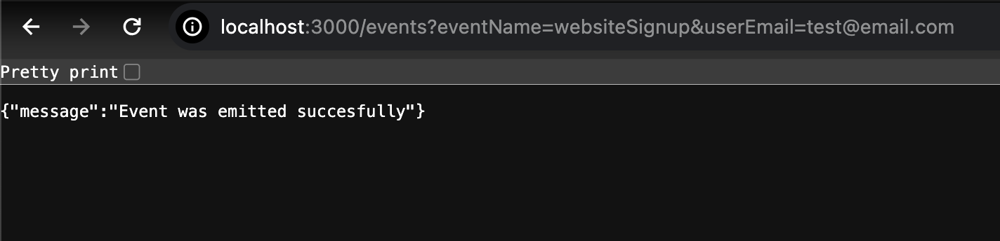
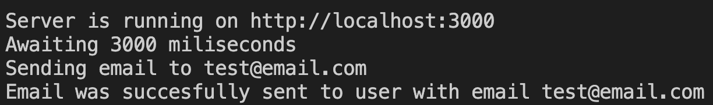
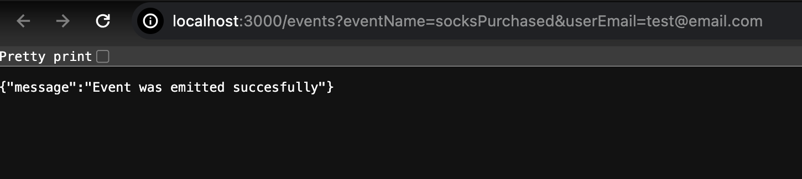
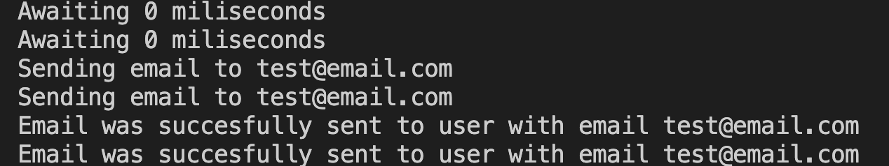
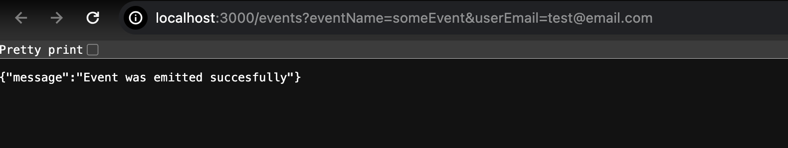
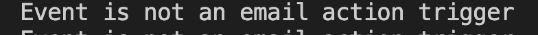
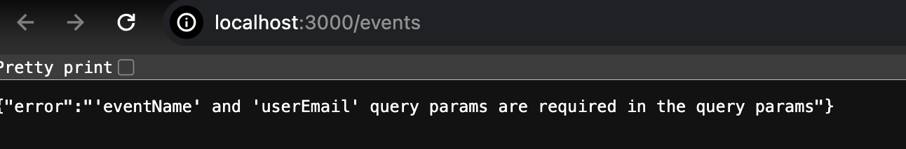
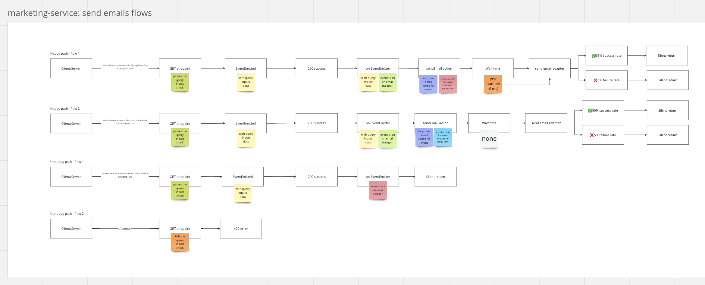

## MARKETING_SERVICE

[Task requirements](https://healthtech1.notion.site/Healthtech-1-Engineer-Take-Home-Test-7a0cf51aa622466eb851763ebc4bf2e6)

Author: [Ioana Comsa](mailto:ioanacomsa85@gmail.com)

[Video](https://www.loom.com/share/a8ec1027c2dd4418bbb8cb1201b3ffbf?sid=03409da4-eb5a-47fc-b881-6cc81a09a11b) overview on what to expect in the readme file and when running the application.

## Proposed Solution

- We have a `GET` endpoint that takes the event name and the user email address as query params
- When the endpoint is called, we check if the two query params are present in the query
  - if no, we return an error with status `400`
  - if yes, we emit an event called `EventEmitted` and return an event emitted succesfully message and status `200`
- We have an event listener as well that we use to listen to the `EventEmitted` event
- When an event is received, we check if
  event name and user email are present in the event
  - if no, we simply return
  - if yes, we carry on
- We also have a config schema that we use to validate that the event received is an email trigger event
- The config schema is an array of objects that include the name of the event, the delay time (in ms) before sending the email, the subject and the body of the email
- If the event name matches one in the schema we then proceed with sending the events accordinly, otherwise, we simply return
- Tests wise we have:
  - end2end tests for full feature behaviour
  - unit tests for the adapter, action and config getter

### Assumptions made:

- We may have multiple emails triggered in one go, and the delay time might differ for each, so the config is sorted at the "run" time based on the delay time
- The delay solution can be anything that can work
- Called the service `marketing-service` as maybe for now this can expand to include other type of marketing services, but it may also stay specific for marketing emails, and it that case a more specific name might work better

### Some decisions made specifically for this point in time:

- We use `setTimeout` as the delay mechanism.
  - Aternative: We could use a `cron` job as well or potentially a step functions mechanism if the service is deployed in the cloud. For sure it will be better to add a specific timestamp for when an email should be sent instead of the current implementation.
- We use `console.log` to trace the service bevaiour. This was chosen so to display the delay behaviour in the terminal, and potentially useful for observability purposes as a concept
  - Alternative: A proper logger system that can be used for debugging and observability or replaced with something else (partially or completelly)
- We do not throw errors in some instances. We should, to trigger retrial mechanisms potentially and for alerting purposes
- We have only one endpoint for that listens to the event - as mentioned in the task requirements. We might want to split that in the future.
- The delay time is in `ms`, just for testing purposes.
- The email data is not passed through the send email adapter, hence no behaviour is connected to it
  - In reality, that should be passed through the adapter
- The user email address is visible in the url and passed through the logs and everywhere else. This is not acceptable in production with real customers and will need to be amended for security purposes.

## Screenshots

- how the application behaves in the browser/postman
- how the application behaves in the terminal

#### Happy path - flow 1

- An event is emitted when customer signs up on the website via an endpoint that includes event and user details in the query params
- The event triggers an email communication to the customer and is sent with a delay time (for testing purposes 3000 miliseconds)

#### Happy path - flow 2

- An event is emitted when customer purchases socks via an endpoint that includes event and user details in the query params
- The event triggers two email communications to the customer and are both sent with no delay time (for testing purposes 3000 miliseconds)

#### Unhappy path - flow 1

- Another event is emitted via an endpoint that includes event and user details in the query params
- The event does not trigger any email communication to the customer

#### Unhappy path - flow 2

- An endpoint is accessed with no event and user details in the query params
- No event is emitted

#### Flow service structure schema

## Libraries / Tools Used

- TypeScript
- Express.js
- Jest
- Supertest
- Prettier

## Setup

To install the dependencies run:

`npm install`

To run the server:

`npm start`

To see the app in action, either in Postman or in the browser go to:

- http://localhost:3000/events?eventName=websiteSignup&userEmail=test@email.com - for happy path flow 1
- http://localhost:3000/events?eventName=socksPurchased&userEmail=test@email.com - for happy path flow 2
- http://localhost:3000/events?eventName=someEvent&userEmail=test@email.com - for unhappy path - event is not email trigger
- http://localhost:3000/events - for unhappy path - bad request

Logs are added in the console and can be seen in the terminal, hence the delay behaviour can be noticed accordingly there.

## Running the tests

You can run the unit tests using:

`npm run test`

Coverage is available as well

## Running prettier

`npm run prettier`
